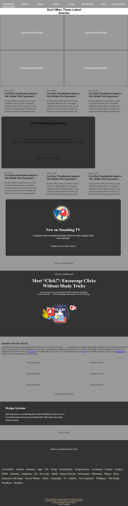

# Smashing-magazine-clone

> visual hierachy, typography and UX design

This project is to demonstrate our level of understanding and to start training ourselves in terms of visual hierachy, typography and visual principles.

## Built With

-   HTML
-   CSS

## Live Demo

[Live Demo Link](https://rawcdn.githack.com/emmanuellekamwa/Smashing-magazine-clone/879eeff888d823e5b14b9f7a4f627ac4e8617b25/index.html)

## Authors

👤 **Guy Gustave Nigaba**

-   Github: (https://github.com/Guy.Gustave/)
-   Linkedin: (https://www.linkedin.com/in/guy-gustave-nigaba/)

👤 **Emmanuelle Kamwa**

-   Github: [@emmanuellekamwa](https://github.com/emmanuellekamwa)
-   Twitter: [@AlixKamwa](https://twitter.com/AlixKamwa)
-   Linkedin: [emmanuelle-kamwa-86145a1a4](https://www.linkedin.com/in/emmanuelle-kamwa-86145a1a4/)
